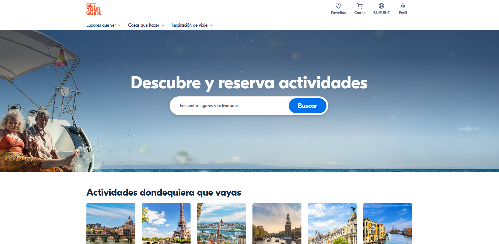
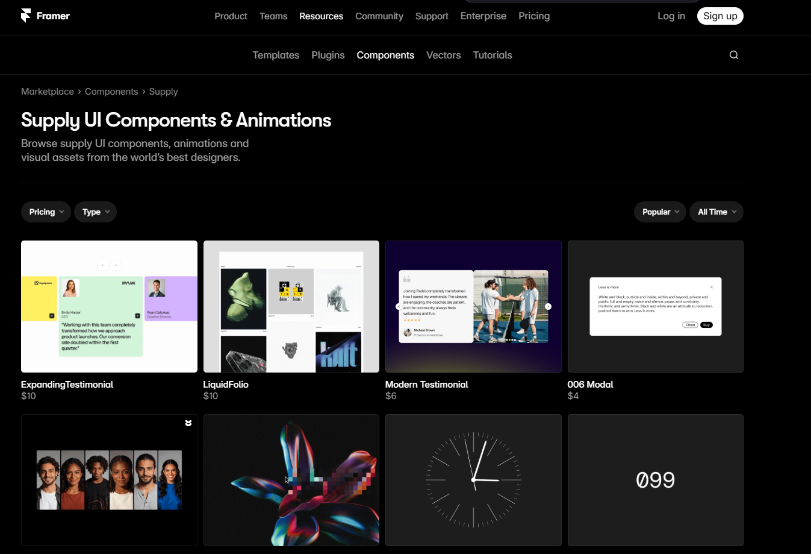
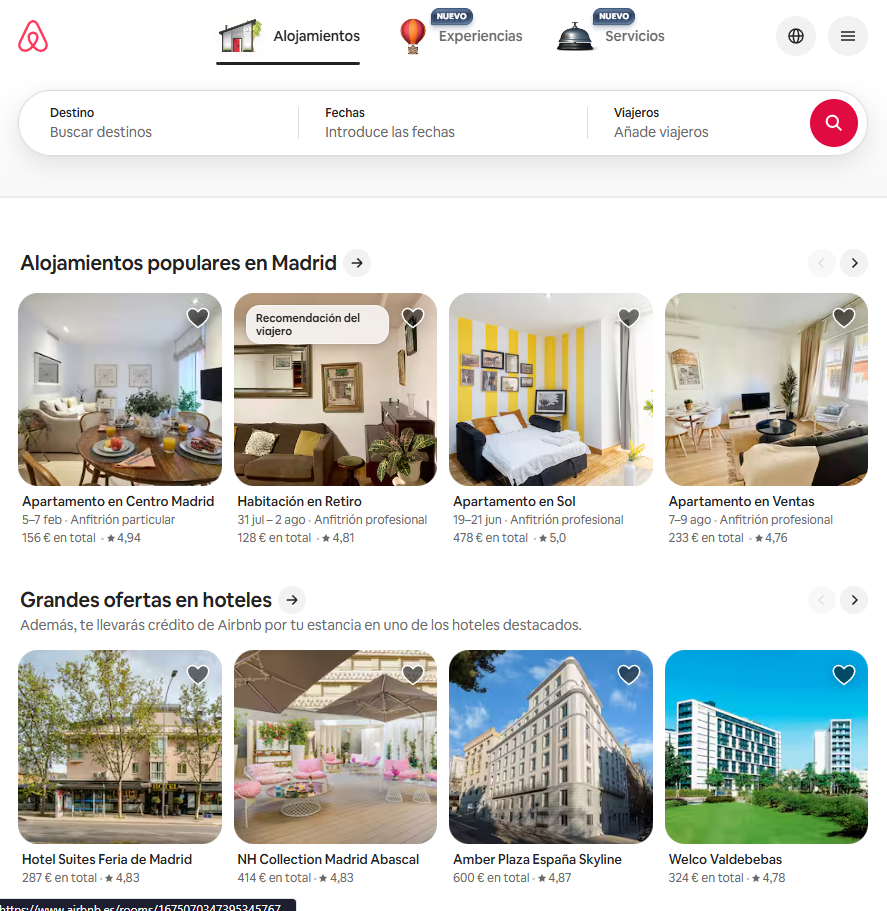

# Design References: Wanderlust Labs Explorer

## Design References (Visuales)

Las siguientes capturas muestran las interfaces que inspiran el diseño de Wanderlust Labs Explorer:

### 1. GetYourGuide

_Barra de búsqueda central, fondo visual atractivo y enfoque en actividades._

### 2. Framer Supply

_Diseño minimalista, cuadrícula de tarjetas limpias y navegación moderna._

### 3. Airbnb (Experiencias)

_Tarjetas visuales, filtros horizontales y experiencia de usuario intuitiva._

Para el desarrollo del MVP, se han seleccionado las siguientes tres interfaces como referencia. Estas plataformas destacan por su claridad visual, el uso de tarjetas y, sobre todo, por una gestión impecable de filtros sincronizados con la URL.

---

## 1. Airbnb (Experiencias)
**Por qué es referencia:**
Es el estándar de la industria para el descubrimiento de actividades. 
* **UI de Tarjetas:** Utiliza una jerarquía visual clara donde la imagen es la protagonista, ideal para "vender" la experiencia visualmente.
* **Filtros Horizontales:** Su sistema de categorías e iconos en la parte superior permite filtrar rápidamente sin saturar la pantalla.
* **Estado de URL:** Cada cambio en el filtro se refleja instantáneamente en la barra de direcciones, permitiendo compartir búsquedas exactas.

## 2. GetYourGuide
**Por qué es referencia:**
Se especializa en tours y actividades de viaje, muy similar al modelo de negocio de Wanderlust Labs.
* **Barra de Búsqueda Robusta:** Implementa un diseño de "búsqueda global" (Destino + Fecha + Categoría) que es extremadamente funcional.
* **Sistema de Filtros Lateral:** Ofrece un ejemplo perfecto de cómo organizar filtros complejos (precio, idioma, duración) de forma limpia y legible.
* **Velocidad de Respuesta:** El filtrado se siente instantáneo, lo cual es el objetivo de usar Next.js en este reto.

## 3. Framer Supply (Templates/Components)
**Por qué es referencia:**
A diferencia de las anteriores, esta es una referencia puramente estética y de "limpieza".
* **Minimalismo:** Presenta una cuadrícula de tarjetas con mucho aire y tipografías modernas que encajan con la estética "Tech" de una startup actual.
* **Interacciones "Sin Recarga":** La navegación entre categorías y etiquetas es fluida, proporcionando la experiencia de Single Page Application (SPA) que el equipo de ingeniería requiere.

---

### Notas de Implementación para Copilot:
* Inspirarse en **Airbnb** para el diseño de la `ExperienceCard`.
* Emular la lógica de **GetYourGuide** para el componente `SearchFilters`.
* Utilizar la limpieza visual de **Framer** para el `Layout` general.